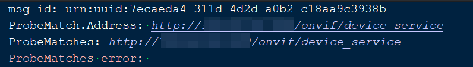

# libStdONVIF
A C++11-based (and above) library for developing ONVIF protocol  
After careful consideration, I decided to change the name to libStdONVIF, intending to indicate that I am developing it using STD C++, and to minimize reliance on heavier third-party libraries.  
The reason is that cross-platform compilation and development are used, and third-party libraries also need to be compiled.
# Introduction
What is ONVIF? https://www.onvif.org/  
This is my first open-source project. I don't know how the final result will be, so let's give it a try and work hard  
Prepare the protocols to be supported:   
ONVIF 分析：http://www.onvif.org/ver20/analytics/wsdl  
ONVIF 设备：http://www.onvif.org/ver10/device/wsdl  
ONVIF 显示：http://www.onvif.org/ver10/display/wsdl  
ONVIF 事件：http://www.onvif.org/ver10/events/wsdl  
ONVIF 图像：http://www.onvif.org/ver20/imaging/wsdl  
ONVIF 媒体：http://www.onvif.org/ver10/media/wsdl  
ONVIF 媒体2：http://www.onvif.org/ver20/media/wsdl  
ONVIF PTZ：http://www.onvif.org/ver20/ptz/wsdl  
ONVIF 接收器：http://www.onvif.org/ver10/receiver/wsdl  
ONVIF 录制：http://www.onvif.org/ver10/recording/wsdl  
ONVIF 回放：http://www.onvif.org/ver10/replay/wsdl  
# Development environment
Ubuntu system, C++11 and above standards, if other Linux systems, you can try yourself, if there are problems, you can also contact me。
For now, to make things easier, we are temporarily considering using the WSL-Ubuntu system for development.
# test result

# Conclusion
Start striving!
############
